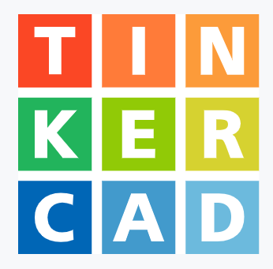

# 아두이노

## 1. 실습 전용 사이트 및 Tools

▲ CLICK

## 2. 커뮤니티 및 개발도구

[Arduino Playground](https://playground.arduino.cc/)
 - 프로젝트 개발 예제
 - 여러 가지 문제에 대한 해결책 제공

[Sketch](https://www.arduino.cc/en/tutorial/sketch)
 - 아두이노 하드웨어에서 이해할 수 있는 코드로 변환해줌

[Arduino Reference](https://www.arduino.cc/reference/en/)
 - Language Reference

## 3. Arduino UNO based Lecture

### [1. Getting Started](./[1]Basic/01.Getting_Started.md)