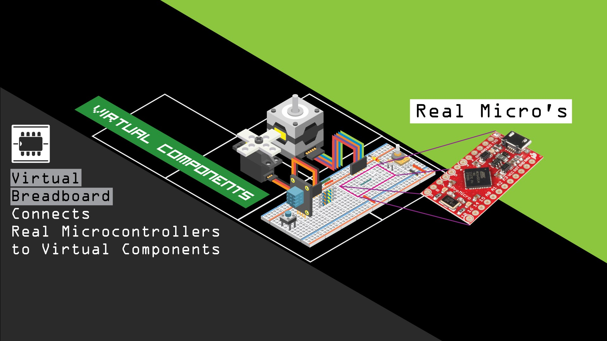

# 아두이노

## 1. 실습 전용 사이트 및 Tools

▲ IMAGE CLICK TO OPEN SITE

▲ IMAGE CLICK TO OPEN SITE

 - [Documentation](https://www.virtualbreadboard.com/docs)
 - [Code Labs](https://www.virtualbreadboard.com/codelabs)

## 2. 커뮤니티 및 개발도구

[Arduino Playground](https://playground.arduino.cc/)
 - 프로젝트 개발 예제
 - 여러 가지 문제에 대한 해결책 제공

[Sketch](https://www.arduino.cc/en/tutorial/sketch)
 - 아두이노 하드웨어에서 이해할 수 있는 코드로 변환해줌

[Arduino Reference](https://www.arduino.cc/reference/en/)
 - Language Reference

## 3. Arduino UNO based Lecture

### [1. Getting Started](./[1]Basic/01.Getting_Started.md)

### [2.아두이노 주요문법](./[1]Basic/02.아두이노_주요문법.md)