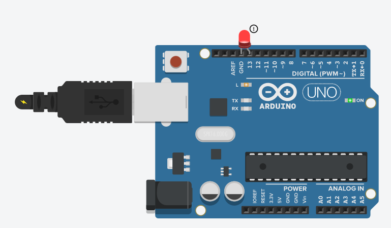
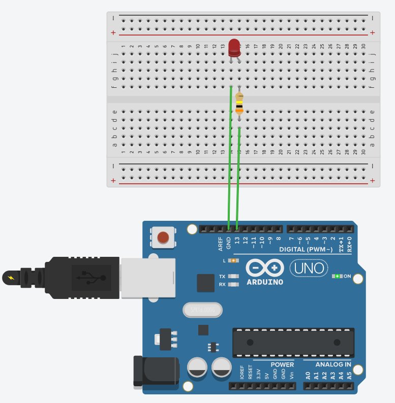
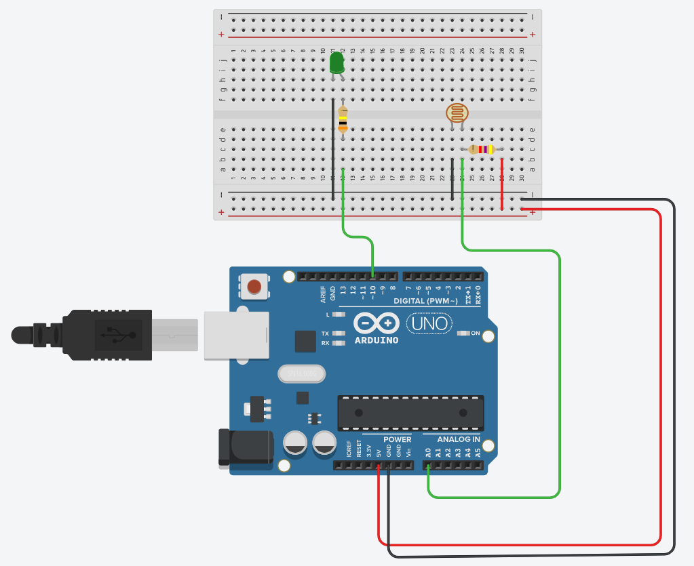

# 01. Getting Started

## - 아두이노(Arduino)란?

<br><br><br><br><br>
<hr>
<br><br><br><br><br>

## - `Arduino UNO`


<br><br><br><br><br>
<hr>
<br><br><br><br><br>

## - 첫 아두이노 프로그래밍

LED와 연결되어 있는 `디지털 13번핀`을 이용하여 전구가 1초 간격으로 반짝거리는 프로그램을 작성해보자.

```c++
void setup()
{
  pinMode(13, OUTPUT); //Set Output Pin
}

void loop()
{
  // turn the LED on (HIGH is the voltage level)
  digitalWrite(13, HIGH);
  delay(1000); // Wait for 1000 millisecond(s)
  // turn the LED off by making the voltage LOW
  digitalWrite(13, LOW);
  delay(1000); // Wait for 1000 millisecond(s)
}
```

### * 회로 구성 1



위와 같이 구성해도 되지만 이렇게 구성하게 되면 부하를 많이 주게 된다.

LED는 2V에 10mA~20mA가 좋고 아두이노 UNO는 5V이므로 약 300옴의 저항을 주어 안정성 있는 회루 구성을 배치해보자.

### * 회로 구성 2




<br><br><br><br><br>
<hr>
<br><br><br><br><br>

## - 아날로그 신호 사용해보기

단순히 전구(LED)가 켜지고 꺼지는 것이 아니라 감지하는 빛의 양에 따라 값이 변하는 저항기인 포토 레지스트(LDR)를 이용하여, 감지되는 빛이 많을 수록 전구가 어둡게, 그리고 감지되는 빛이 적을 수록 전구가 밝게 설정해보자.

참고로 전구의 밝기 값은 0~255이다. 그리고 포토 레지스트에 들어가는 저항값은 4700으로 설정하자.

```c++
//LDR 저항값 4700옴

const int ledPin = 10; //디지털 ~10번핀
const int sensorPin = 0; //아날로그 0번핀

void setup(){
  Serial.begin(9600); //9600의 통신속도로 시리얼 통신
  pinMode(ledPin, OUTPUT);
}

void loop(){
  //아날로그 입력을 읽음 (약100에서 1000의 값이 들어옴)
  int sensor_value = analogRead(sensorPin); 
  
  //아날로그 입력값에 따라 최소 및 최대값 설정
  int brightness = map(sensor_value, 100, 1000, 0, 256);
  Serial.println(brightness); //시리얼 모니터로 값 출력
  
  analogWrite(ledPin, brightness);
}
```

### * 회로 구성


