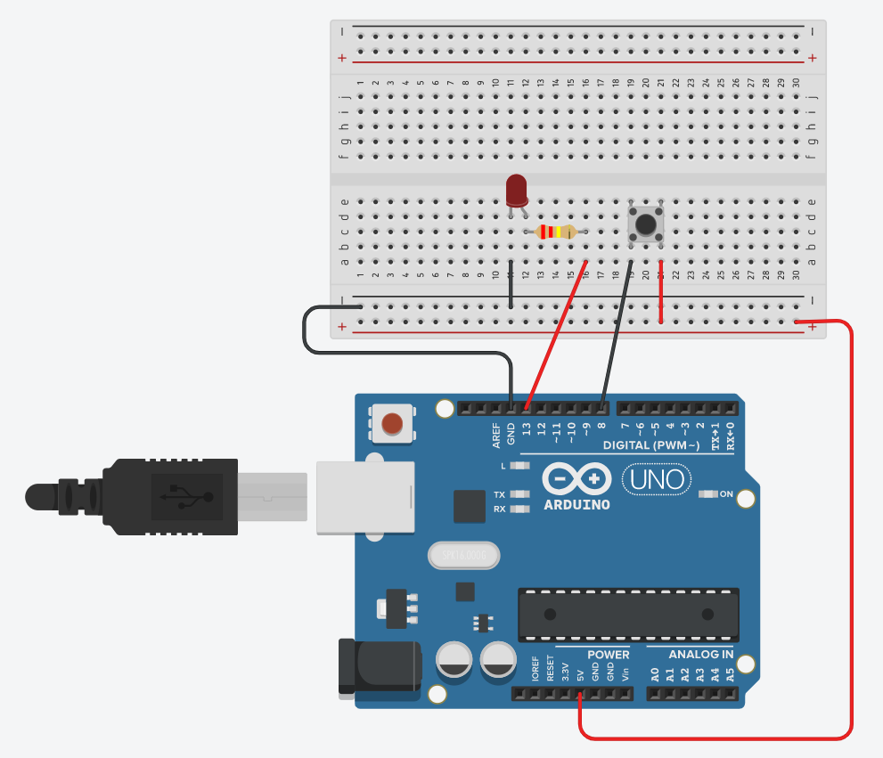
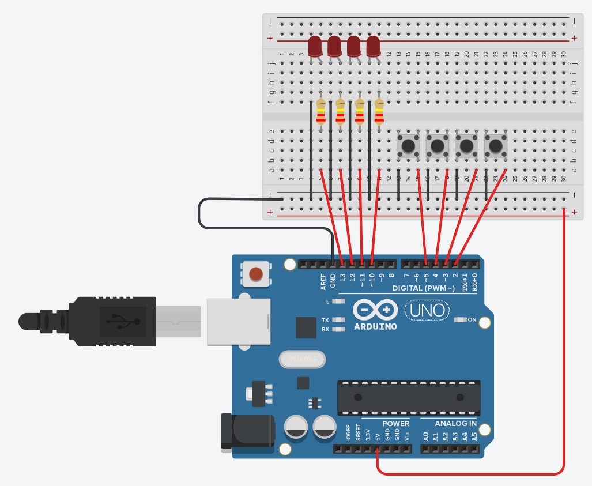

# 02. 아두이노 문법

아두이노 IDE인 스케치(Sketch)와 아두이노에서 사용하는 언어는 C와 C++이다. 여기서는 C 및 C++ 언어에 대한 자세한 설명은 하지 않고 아두이노 내장 라이브러리의 함수(Functions), 변수(Variables), 그리고 구조(Structure)에 대해서 다뤄본다.

## - 기본 구조

```c++
void setup(){
    //초기화 구간
}

void loop(){
    //반복 구간
}
```

<br><br><br><br><br>
<hr>
<br><br><br><br><br>

## - 기본 함수

### * Serial

 - `Serial.begin()`

아두이노의 시리얼 통신속도는 300~250,000bps까지 지원되지만 Serial 라이브러리는 115,200bps까지만 지원된다. 그러므로 시리얼 통신속도가 115,200bps를 넘지 않는 것이 좋다.

보통은 9600으로 설정한다.

```c++
Serial.begin(9600);
```


- `Serial.print()` a nd `Serial.println()`

시리얼 모니터에 출력하는 함수이다.

`println()`을 사용하면 개행이 이루어지면서 출력된다.


 - `Serial.read()` and `Serial.available()`

아두이노에는 Buffer가 있는데 시리얼 통신으로부터 문자를 입력받으면 Buffer가 늘어난다. 다음 예제를 통해 버퍼가 늘어나는 것을 보자.

```c++
void setup(){
  Serial.begin(9600); //9600의 통신속도로 시리얼 통신
}

void loop(){
  int buffer_num = Serial.available();
  Serial.println(buffer_num);
}
```
위 예제를 실행 후 시리얼 통신 입력을 해보고 늘어나는 버퍼를 확인해보자. `available()`은 버퍼안의 데이터 개수를 체크해준다. 아무 것도 없으면 0이 출력될 것이다.

`read()`는 버퍼의 첫번째 문자를 읽어 반환하고 없으면 -1이 출력된다.

```c++
void setup(){
  Serial.begin(9600); //9600의 통신속도로 시리얼 통신
}

void loop(){
  int buffer_size = Serial.available();
  Serial.println(Serial.read());
  delay(1000);
}
```
위 예제를 실행하면 알 수 있듯이 문자의 아스키 값으로 출력되는 것을 볼 수 있다. char형으로 캐스팅하면 문자형태로 출력을 할 수 있다.

```c++
void setup(){
  Serial.begin(9600); //9600의 통신속도로 시리얼 통신
}

void loop(){
  
  
  int buffer_size = Serial.available();
  int data = Serial.read();
  if(data != -1){
    Serial.println((char)data);
  }
  
}
```

<br><br><br>

### * Digital

- `pinMode(pin, mode)`

디지털 값을 읽거나 쓰도록 디지털 핀을 구성하며 `HIGH` 및 `LOW` 내장 변수를 사용한다.

 - `digitalRead(pin)` and `digitalWrite(pin, value)`

특정 디지털 핀의 값을 읽거나 특정 디지털 핀에 값을 출력한다.

```c++
void setup()
{
  Serial.begin(9600);
  pinMode(13, OUTPUT); //LED
  pinMode(8, OUTPUT);  //Button
}

void loop()
{
  bool isClicked = digitalRead(8);
  Serial.println(isClicked);
  if(isClicked){
  	digitalWrite(13, HIGH);
  }else{
   	digitalWrite(13, LOW);
  }
  delay(10);
}
```


위 예제는 버튼 클릭을 하면 LED가 켜지고 버튼을 클릭하지 않으면 LED가 꺼지는 `digitalRead()`와 `digitalWrite()`를 활용한 예제다.


<br><br><br><br><br>
<hr>
<br><br><br><br><br>

## - 기본 자료형

 - int
 - unsigned int
 - long
 - unsigned long
 - float = double
   - 아두이노에서는 float과 double은 이름만 같을 뿐 동일한 데이터 유형이다.
- boolean
- char
- byte
- String
- void
   - void는 함수 선언에서만 사용된다.


### * Array

배열을 사용해 여러 핀을 한번에 설정해보자.

```c++
int inputPins[] = {2, 3, 4, 5};
int ledPins[] = {10,11,12,13};

void setup(){
  
    for(int i = 0; i < 4; i++){
        pinMode(inputPins[i], INPUT);
        pinMode(ledPins[i], OUTPUT);
        //플로팅 현상 해결
        digitalWrite(inputPins[i], INPUT_PULLUP);
    }
}

void loop(){
    for(int i = 0; i < 4; i++){
        int input_val = digitalRead(inputPins[i]);
      if(input_val == 1){
      	digitalWrite(ledPins[i], HIGH);  
      }else{
		digitalWrite(ledPins[i], LOW);
      }
    }
}
```


(여기서 플로팅 현상이란 스위치가 열려있을때, IO핀으로 들어가는 신호는 HIGH일지 LOW일지 알 수 없는 현상을 말한다)
